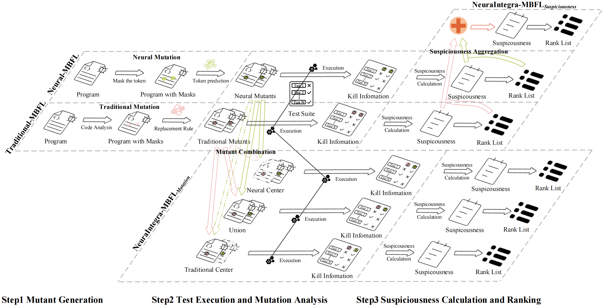

# Neural-MBFL-ex
This project is the experimental code for paper "Integrating Neural Mutation into Mutation-Based Fault Localization: A Hybrid Approach".
Neural-MBFL is a novel fault localization approach based on neural mutation. 
Additionally, we introduce NeuraIntegra-MBFL, an integrating
approach that combines Neural-MBFL and Traditional-MBFL using various integration strategies such as mutant combination and suspiciousness aggregation.

Below is an experimental framework diagram of our project:


## Requirements
- Python 3.7.0
- [*Defects4J v2.0.0*](https://github.com/rjust/defects4j/tree/v2.0.0)
- [*μBERT*](https://github.com/rjust/defects4j/tree/v2.0.0)
    - [*CodeBERT*](https://github.com/microsoft/CodeBERT) dependencies:
    - `pip install torch`
    - `pip install transformers`

## Set Up
To run this project, you need to set up the following environment:
1. export the project root path as `SOFTWARE_TESTING_ROOT`

    `export SOFTWARE_TESTING_ROOT=/path/to/Neural-MBFL`

2. configure the `pathConfig.json` file in the root directory

## Project Structure
```
Neural-MBFL-ex
├── Mutation
│   └── 0MutationScripts
│       ├── majorMutation.py
│       ├── MajorMutation.sh
│       ├── mBert4d4j-automulti_D4J.py
│       ├── SubProcessEnvTest.py
│       └── transferMajorToMbert.py
├── MutationAnalysis
│   └── 0MutationAnalyst
│       ├── changeFileToJson.py
│       ├── runMutantFaultyFile-automulti-major.py
│       └── runMutantFaultyFile-automulti-mBert.py
├── FaultLocalization
│   └── MBFL_Scripts
│       ├── FLWorkflow.sh
│       ├── Metric_calcutor.py
│       ├── MutantSus_calculator.py
│       ├── MutantSusEx_calculator.py
│       ├── StatementRank_statistic.py
│       ├── StatementSus_calculator.py
│       ├── StatementSusEx_calculator.py
│       ├── SusFormulas.py
│       └── Utils.py
├── Experiments
│   ├── DataSetDescripion.ipynb
│   ├── Experiments.ipynb
│   ├── FLResultAnalyst.py
│   ├── StatisticAnalysis.py
│   └── Utils
│       ├── __init__.py
│       ├── ColorPalette.py
│       ├── DatasetConfig.py
│       ├── FileStatistic.py
│       ├── PandasHelper.py
│       └── STEnvConfig.py
└── pathConfig.json
```


### Mutation Geneartion:
```
Neural-MBFL-ex
└── Mutation
    └── 0MutationScripts
        ├── majorMutation.py
        ├── MajorMutation.sh
        ├── mBert4d4j-automulti_D4J.py
        ├── SubProcessEnvTest.py
        └── transferMajorToMbert.py
```
Scripts for generating mutants using neural mutation and traditional mutation techniques.
- MajorMutation.sh and majorMutation.py: Script for generating mutants using traditional mutation technique-major.
    - transferMajorToMbert.py: Script for transferring the generated mutants from major to mBert format.
- mBert4d4j-automulti_D4J.py: Script for generating mutants using neural mutation technique-mBert.
    - SubProcessEnvTest.py: Script for setting up the environment and running mBert4d4j-automulti_D4J.py

### Test Execution and Mutation Analysis:
```
Neural-MBFL-ex
└── MutationAnalysis
    └── 0MutationAnalyst
        ├── changeFileToJson.py
        ├── runMutantFaultyFile-automulti-major.py
        └── runMutantFaultyFile-automulti-mBert.py
```
Execution of mutants to gather execution information and scripts for mutation analysis
- runMutantFaultyFile-automulti-mBert.py: Script for executing the mutants using neural mutation technique-mBert
- runMutantFaultyFile-automulti-major.py: Script for executing the mutants using traditional mutation technique-major
- changeFileToJson.py: Script for converting the execution information to json format

### Fault Localization and Ranking Techniques: 
```
Neural-MBFL-ex
└── FaultLocalization
    └── MBFL_Scripts
        ├── FLWorkflow.sh
        ├── MutantSus_calculator.py
        ├── MutantSusEx_calculator.py
        ├── StatementSus_calculator.py
        ├── StatementSusEx_calculator.py
        ├── StatementRank_statistic.py
        ├── Metric_calcutor.py
        ├── SusFormulas.py
        └── Utils.py
```
Analysis of mutant execution information for fault localization and scripts for calculating some evaluation metrics
- FLWorkflow.sh: Script for running the fault localization workflow
    - MutantSus_calculator.py: Script for calculating the mutant suspiciousness for Neural-MBFL and Traditional-MBFL
        - MutantSusEx_calculator.py: Script for calculating the mutant suspiciousness for NeuraIntegra-MBFL<sub>*Mutation*</sub>
    - StatementSus_calculator.py: Script for calculating the statement suspiciousness for Neural-MBFL and Traditional-MBFL
        - StatementSusEx_calculator.py: Script for calculating the statement suspiciousness for NeuraIntegra-MBFL<sub>*Mutation*</sub> and NeuraIntegra-MBFL<sub>*Suspicousness*</sub>
    - StatementRank_statistic.py: Script for calculating the statement ranking statistics
    - Metric_calcutor.py: Script for calculating the Top-N, MAP and EXAM metrics
    - SusFormulas.py: The suspiciousness formulas
    - Utils.py: Utility script


### Result Analysis:
```
Neural-MBFL-ex
└── Experiments
    ├── DataSetDescripion.ipynb
    ├── Experiments.ipynb
    ├── FLResultAnalyst.py
    ├── StatisticAnalysis.py
    └── Utils
        ├── __init__.py
        ├── ColorPalette.py
        ├── DatasetConfig.py
        ├── FileStatistic.py
        ├── PandasHelper.py
        └── STEnvConfig.py
```
Scripts related to the analysis of Dataset Description, RQs (Research Questions) and Discussion
- DataSetDescripion.ipynb: Script for the Dataset Description
- Experiments.ipynb: Script for the RQs (Research Questions) and Discussion

    Containing Top-N, MAP and EXAM Distribution with Statistic Analysis for RQ1 and RQ3, MTP (Mutant-Test Pair) for RQ1, Correlation Analysis and Overlap Analysis for RQ2 and RQ4, and the Repair Pattern Analysis for Discussion
- FLResultAnalyst.py: Script for collect and statistic the fault localization results
- StatisticAnalysis.py: Script for assisting the statistical analysis of the results
- Utils: Utility scripts
